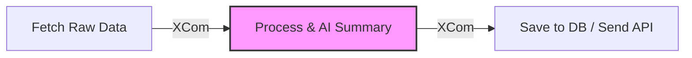

# refactor: WorkFlowManager 기능의 DAG Task 단위 해체 및 최적화

## 🎯 목적
현재 `WorkFlowManager` 클래스의 단일 메서드(`update_bills_data` 등) 호출로 이루어진 Monolithic 구조를 Airflow의 철학에 맞게 **Task 단위로 세분화(Decomposition)**하여 운영 효율성과 관측성(Observability)을 극대화합니다.

## 🛠️ 문제점
현재 구조에서는 다음과 같은 한계가 존재합니다.
1. **에러 처리의 비효율성**: 파이프라인의 마지막 단계(예: AI 요약)에서 에러가 발생해도, 재시도 시 처음(데이터 수집)부터 다시 수행해야 할 수 있음.
2. **낮은 관측성**: 전체 작업이 하나의 Task로 표시되어, 내부의 어떤 단계(수집 vs 가공 vs 전송)에서 시간이 오래 걸리는지 UI상에서 파악하기 어려움.
3. **확장성 제약**: 기능 수정 시 거대한 `WorkFlowManager` 클래스를 수정해야 하므로 Side Effect 위험이 높음.

## 📅 세부 작업 계획 (Phased Approach)

### Phase 1: 주요 단계 분리 (Major Step Decomposition)
`WorkFlowManager` 내부의 핵심 로직을 크게 3~4개의 논리적 블록으로 분리하여 각각 별도의 Task로 정의합니다.

1. **데이터 수집 (Data Fetching)**
   - API 호출 및 Raw Data 확보
   - 결과: Raw Data (JSON/dict) -> XCom 저장
2. **데이터 가공 및 AI 요약 (Processing & AI Summary)**
   - XCom에서 Raw Data 로드
   - 전처리 및 Gemini AI 요약 수행 (**가장 실패율이 높은 구간**)
   - 결과: Processed Data -> XCom 저장
3. **데이터 저장 및 전송 (Storage & Transmission)**
   - DB 적재 (`DatabaseManager`) 및 API 서버 전송 (`APISender`)

### Phase 2: 완전한 Native Airflow화
`WorkFlowManager` 클래스 의존성을 제거하고, 각 기능을 독립적인 파이썬 함수나 커스텀 Operator로 변환합니다.

- **Custom Operators 개발**:
    - `LawDigestFetchOperator`: 국회 API 특화 수집
    - `LawDigestAIOperator`: Gemini 연동 및 요약 특화
    - `LawDigestDbOperator`: 데이터 적재 특화

## ✅ 완료 조건
- [ ] `WorkFlowManager`의 로직이 최소 3단계(수집/가공/저장) 이상의 Task로 분리되어 DAG에 적용될 것
- [ ] Task 간 데이터 전달이 Airflow **XCom**을 통해 이루어질 것 (대용량 데이터 고려)
- [ ] Airflow UI에서 각 단계별 소요 시간과 성공/실패 여부가 시각적으로 확인될 것
- [ ] AI 요약 단계 실패 시, 수집 단계 재수행 없이 **요약 단계부터 재시도(Retry)**가 가능할 것

## ⚠️ 유의사항
- **XCom 용량 제한**: XCom은 메타데이터 DB에 저장되므로 대용량 데이터 전달 시 S3, GCS 또는 로컬 파일 시스템을 경유하는 **Custom Backend** 설정을 고려해야 함.
- **API Rate Limit**: Task가 분리되더라도 동시 실행 제어(Concurrency) 설정을 통해 외부 API 호출 제한을 준수해야 함.
