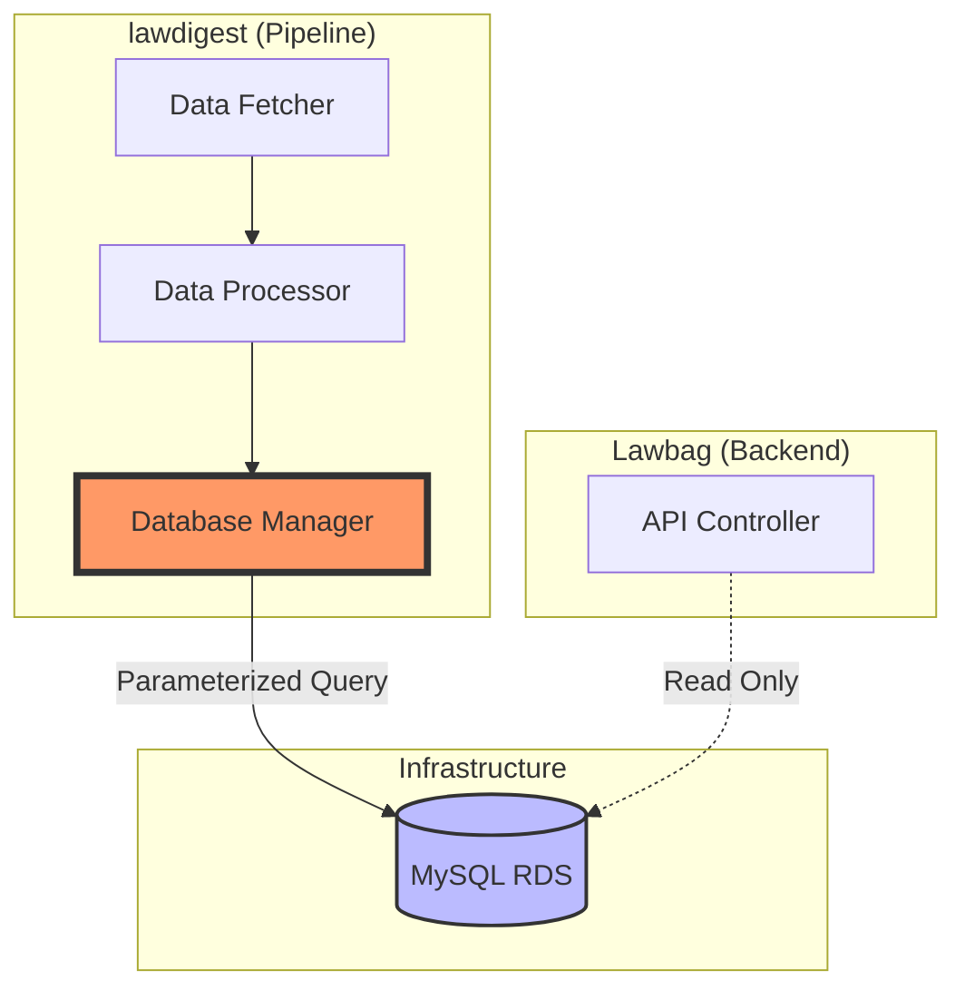
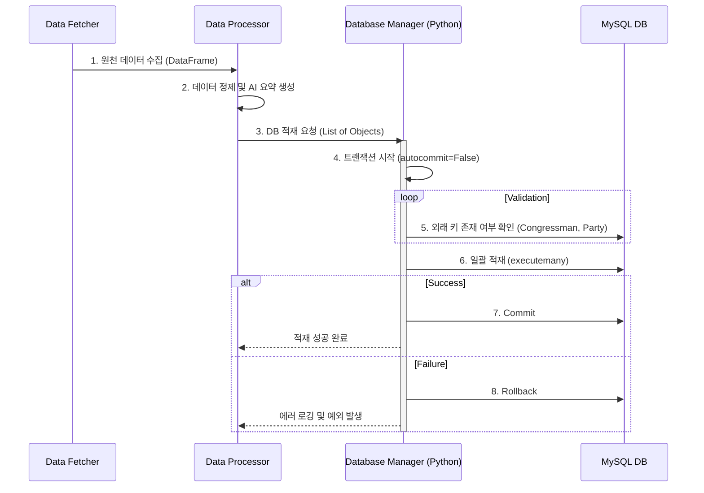

# refactor: 데이터 파이프라인 로직의 DB 직접 접근 방식 이관

## 1. 목적
현재 `Lawbag` API 서버를 통해 간접적으로 수행되는 데이터 적재 과정을 `lawdigest` 파이프라인에서 직접 DB에 접속하여 수행하도록 변경합니다. 이를 통해 백엔드 서버와의 결합도를 낮추고, 대량 데이터 처리 성능과 운영 안정성을 확보합니다.

## 2. 배경 및 문제점
- **의존성 문제(SPOF)**: API 서버 점검/배포 시 데이터 파이프라인 전체가 중단되는 구조적 한계.
- **데이터 불완전성**: 청크(Chunk) 단위 전송 중 부분 실패 시 자동 롤백이 불가하여 데이터 영구 손실 위험.
- **성능 저하**: 불필요한 7-레이어 구조(Python → JSON → HTTP → Spring → JPA → DB)로 인한 오버헤드.
- **개발 병목**: 스키마 변경 시 양쪽 프로젝트를 동시에 관리해야 하는 운영 효율 저하.

## 3. 개선된 아키텍처 및 데이터 흐름

### 3.1 아키텍처 다이어그램

### 3.2 데이터 처리 순서 (Sequence Diagram)

## 4. 세부 작업 계획 (검토 보고서 기반)

### Phase 1: 기반 구조 개선 (Foundation) - 우선순위: 상
- [ ] **트랜잭션 관리자 구현**: `DatabaseManager`에 Context Manager 패턴을 적용하여 원자성(Atomicity) 보장.
- [ ] **배치 처리 최적화**: `executemany`를 활용하여 네트워크 홉 및 오버헤드 최소화.
- [ ] **비즈니스 엔진 포팅**: Java의 `BillStageType`(법안 단계 순서 검증) 및 `ProposerKindType` 로직 포팅.

### Phase 2: 핵심 로직 이관 (Core Migration) - 우선순위: 상
- [ ] **법안 정보 적재 (`insertBillInfoDf`)**: `Bill` 테이블 및 `BillProposer` 관계 설정 로직 구현.
- [ ] **외래 키 검증 엔진**: JPA가 수행하던 참조 무결성 검증을 Python 레이어에서 수동 구현.

### Phase 3: 복잡 로직 및 통계 이관 (Advanced) - 우선순위: 중
- [ ] **의원 정보 동기화 (`updateLawmakerDf`)**: 3-way 동기화(Insert/Update/State False) 로직 포팅.
- [ ] **상태 업데이트 (`updateBillStageDf`)**: 단계 변경 이력(`BillTimeline`) 관리 및 중복 방지.
- [ ] **통계 집계**: 정당별/의원별 법안 카운트 집계 로직 이관.

## 5. 완료 조건 (KPI)
- [ ] **안정성**: 파이프라인 성공률 99.9% 달성 (API 서버 장애와 무관하게 동작).
- [ ] **정합성**: 기존 API 방식과 직접 적재 방식 간 데이터 불일치 0건.
- [ ] **성능**: 데이터 적재 평균 시간 30% 이상 감소.
- [ ] **신뢰성**: 에러 발생 시 자동 롤백을 통한 데이터 일관성 유지.

## 6. 유의사항
- **트랜잭션 범위**: 연관된 여러 테이블(`Bill`, `BillProposer` 등) 작업이 하나의 트랜잭션으로 묶여야 함.
- **병행 운영 (Dual Write)**: 안정성 검증을 위해 최소 1주일간 기존 API 방식과 병행 운영하며 데이터 정합성 비교 권장.
- **에러 핸들링**: `execute_query`의 반환값 처리 방식을 개선하여 명시적인 예외 전파 유도.

